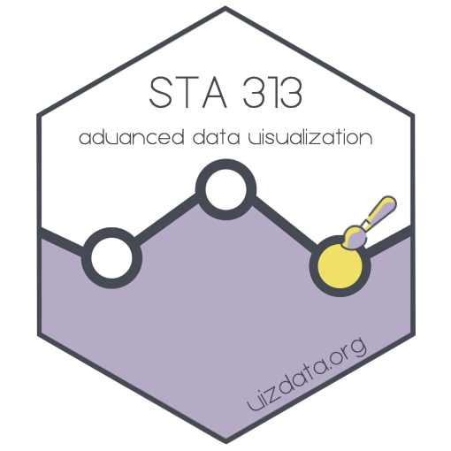

# Advanced Data Visualization {.unnumbered}

This is the homepage for STA 313 - Advanced Data Visualization.
All course materials will be posted on this site.

-   Instructor: [Mine Çetinkaya-Rundel](http://mine-cr.com/)

-   Course meetings:

    -   Lectures: Wednesdays and Fridays, 12:00 - 13:15, Perkins LINK 087 (Classroom 3)
    -   Labs: Mondays, 12:00 - 13:15, Perkins LINK 087 (Classroom 3)

-   Syllabus: **TO DO: ADD DIRECT LINK**

-   Course materials: **TO DO: ADD DIRECT LINK**

    

## License {.unnumbered}

 This online work is licensed under a <a rel="license" href="https://creativecommons.org/licenses/by-sa/4.0/">Creative Commons Attribution-ShareAlike 4.0 International</a>.
Visit [here](https://github.com/dukestatsciintrods/blob/master/LICENSE.md) for more information about the license.

## Acknowledgements {.unnumbered}

...
