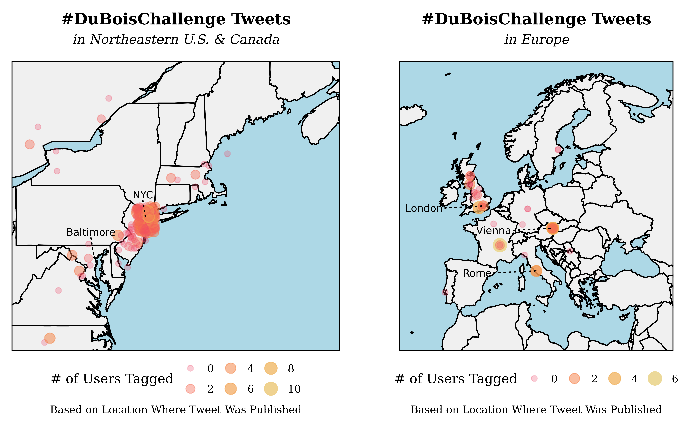
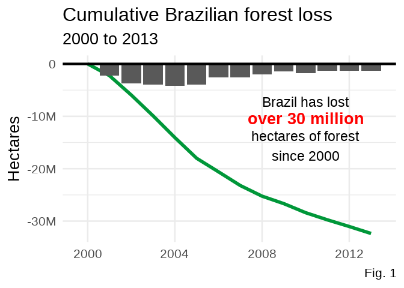
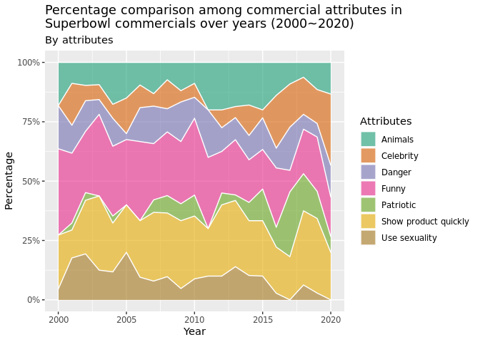
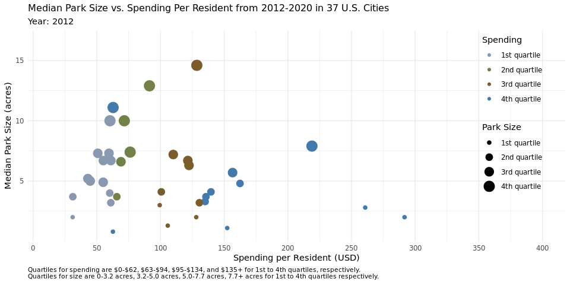
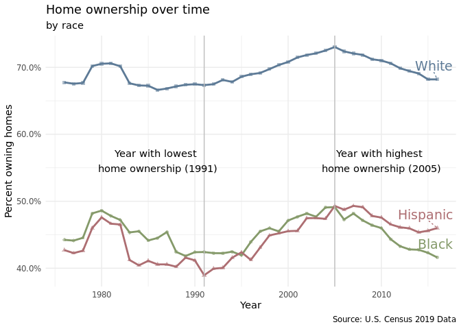
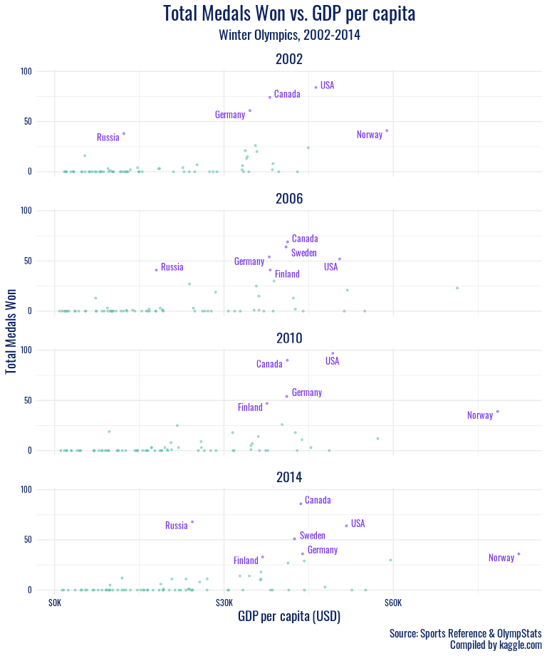
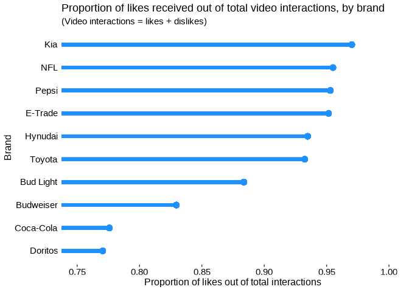

# Project 1 outputs {#project-1-outputs}

The assignment for Project 1 can be found [here](https://www.vizdata.org/project-1.html).

Below are projects the teams produced.

::: project
[**Super Bowl Ads**](https://vizdata-f21.github.io/project-1-dorian_s_gs/) by Dorian's Gs

------------------------------------------------------------------------

[{width="640"}](https://vizdata-f21.github.io/project-1-dorian_s_gs/)

------------------------------------------------------------------------

Explore the factors that contribute to a greater number of Super Bowl ad views and how these change over time as well as the relationship between popularity of a Super Bowl Ad and how much interaction it got.
[*Read more.*](https://vizdata-f21.github.io/project-1-dorian_s_gs/)
:::

::: project
[**Twitter Trends from the #DuBoisChallenge**](https://vizdata-f21.github.io/project-1-ctrl_alt_elite/) by Ctrl+Alt+Elite

------------------------------------------------------------------------

[{width="640"}](https://vizdata-f21.github.io/project-1-ctrl_alt_elite/)

------------------------------------------------------------------------

Explore the content and metadata of tweets that used the #DuBoisChallenge hashtag for the 2021 WEB Du Bois & Juneteenth Twitter challenge focusing locations tweet was sent from as well as the relationship between medium and engagement.
[*Read more.*](https://vizdata-f21.github.io/project-1-ctrl_alt_elite/)
:::

::: project
[**Is soybean use driving global deforestation?**](https://vizdata-f21.github.io/project-1-team_5_look_alive/) by Team 5 Look Alive

------------------------------------------------------------------------

[{width="640"}](https://vizdata-f21.github.io/project-1-team_5_look_alive/)

------------------------------------------------------------------------

Explore which countries are seeing the most deforestation within their borders and understand the causes of this deforestation, with a specific emphasis on Brazil's cumulative forest loss in the last decade as well as soybean consumption.
[*Read more.*](https://vizdata-f21.github.io/project-1-team_5_look_alive/)
:::

::: project
[**Investigating content and audience reactions to YouTube Super Bowl commercials**](https://vizdata-f21.github.io/project-1-r_mageddon/) by R-Mageddon

------------------------------------------------------------------------

[{width="640"}](https://vizdata-f21.github.io/project-1-r_mageddon/)

------------------------------------------------------------------------

Explore the trends in how the content and audience preferences of Super Bowl ads change over the years, as well as how their content and description differ during the election and non-election years.
[*Read more.*](https://vizdata-f21.github.io/project-1-r_mageddon/)
:::

::: project
[**Quality of US Public Parks**](https://vizdata-f21.github.io/project-1-the_scatterplots/) by The Scatterplots

------------------------------------------------------------------------

[{width="640"}](https://vizdata-f21.github.io/project-1-the_scatterplots/)

------------------------------------------------------------------------

Explore the Parks Access dataset from the The Trust for Public Land's ParkScore Index in order to answer questions regarding access and equity to the nation's largest cities' parks.
[*Read more.*](https://vizdata-f21.github.io/project-1-the_scatterplots/)
:::

::: project
[**Visualizing Income Inequality in the United States**](https://vizdata-f21.github.io/project-1-7_up/) by 7-Up

------------------------------------------------------------------------

[{width="640"}](https://vizdata-f21.github.io/project-1-7_up/)

------------------------------------------------------------------------

Explore data from the Urban Institute and the US Census to understand how home-ownership rate and wealth changed have over time and vary between races as well as how household income levels compare between races and within each race.
[*Read more.*](https://vizdata-f21.github.io/project-1-7_up/)
:::

::: project
[**Beyond the Rings: Analyzing Olympic Athlete and Medal-Winning Country Characteristics**](https://vizdata-f21.github.io/project-1-mr_palmer_s_penguins/) by Mr Palmer's Penguins

------------------------------------------------------------------------

[{width="640"}](https://vizdata-f21.github.io/project-1-mr_palmer_s_penguins/)

------------------------------------------------------------------------

Explore data on Olympic games from Athens 1896 to Rio 2016 to understanding physical characteristics of Olympians and features of medal-winning countries.
[*Read more.*](https://vizdata-f21.github.io/project-1-mr_palmer_s_penguins/)
:::

::: project
[**Super Bowl Ads**](https://vizdata-f21.github.io/project-1-the_outliers/) by The Outliers

------------------------------------------------------------------------

[{width="640"}](https://vizdata-f21.github.io/project-1-the_outliers/)

------------------------------------------------------------------------

Explore explore the themes that make Super Bowl ads so popular and how trends change over time.
[*Read more.*](https://vizdata-f21.github.io/project-1-the_outliers/)
:::
