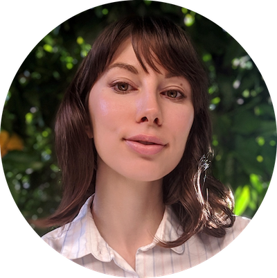

# Teaching team

## Instructor

 [**Dr. Mine Çetinkaya-Rundel**](http://mine-cr.com/) (she/her) is Professor of the Practice and Director of Undergraduate Studies at the Department of Statistical Science at Duke University.
Mine also works with RStudio as a Data Scientist and Professional Educator at RStudio.
Mine's work focuses on innovation in statistics and data science pedagogy, with an emphasis on computing, reproducible research, student-centered learning, and open-source education as well as pedagogical approaches for enhancing retention of women and under-represented minorities in STEM.

Mine's **office hours** are 3-4pm on Tuesdays and 9:30-10:30am on Fridays [on Zoom](https://sakai.duke.edu/portal/site/8bb9612c-0cec-4245-bb50-14e2db668ed4/page/e742f0bb-aa55-4bd5-8aaf-ab50c01fc332).
If you can't make these times, try TA office hours or click [here](https://outlook.office365.com/owa/calendar/mc301@duke.edu/pbp/) to make an appointment.

## Teaching assistants

 **Jennifer Kampe** (she/her) is a PhD student in Statistical Science.
Jennifer is interested in methods for spatio-temporal data, especially as applicable to ecological modeling.

Jennifer's **office hours** are 5-6pm on Thursdays [on Zoom](https://sakai.duke.edu/portal/site/8bb9612c-0cec-4245-bb50-14e2db668ed4/page/e742f0bb-aa55-4bd5-8aaf-ab50c01fc332).

    

 [**Vittorio Orlandi**](https://vittorioorlandi.github.io/) (he/him) is a PhD student in Statistical Science.
Vittorio works on methods in causal inference and Bayesian nonparametrics that can be used in practice, that are designed to handle the complexity inherent in real data without making naive assumptions, and that have have exceptional predictive accuracy as well as other desirable features like interpretability and uncertainty quantification.

Vittorio's **office hours** are 2-3pm on Mondays and 11am-12pm on Tuesdays in person at Old Chem 203B.
